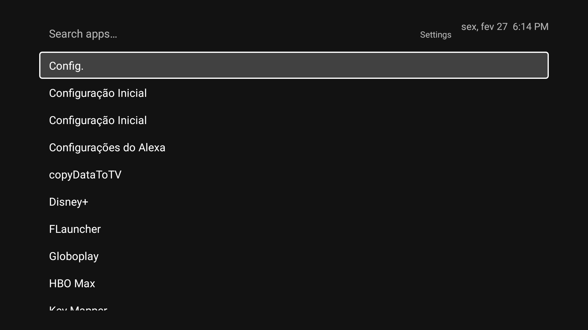

# Lite Launcher

A minimal, text-only Android TV launcher inspired by [OLauncher](https://github.com/tanujnotes/Olauncher). No icons, no clutter — just a fast alphabetical list of your apps with fuzzy search and DPAD navigation.



## Features

- **Text-only app list** — single vertical column, alphabetically sorted
- **Fuzzy search** — start typing to filter apps instantly
- **6 favorite slots** — long-press any app to add it, shown as a horizontal row
- **Background images** — 10 built-in dark wallpapers (or plain black)
- **Accent colors** — 10 color options for the focus highlight
- **Full DPAD support** — designed for Android TV remotes
- **Leanback-aware** — discovers both standard and TV-specific apps

## Tech Stack

- Kotlin + XML Views with ViewBinding
- MVVM with ViewModel + LiveData
- Manual DI (no Hilt/Dagger)
- SharedPreferences for persistence
- Custom fuzzy search (~60 lines, zero dependencies)
- Min SDK 24 / Target SDK 35

## Building

```bash
./gradlew assembleDebug
```

## Installing on a TV

```bash
adb connect <tv-ip>:5555
adb install -r app/build/outputs/apk/debug/app-debug.apk

# Optional: set as default launcher
adb shell cmd package set-home-activity com.litelauncher/.ui.MainActivity
```

## License

MIT
